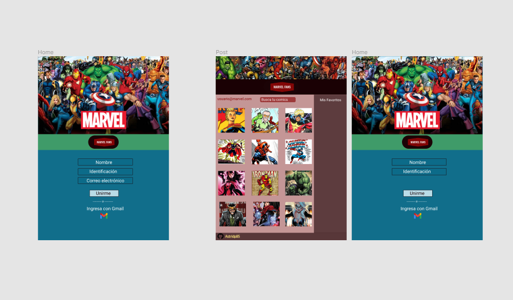

# Marvel Fans 

## Índice

* [1. Preámbulo](#1-preámbulo)
* [2. Resumen del Proyecto](#2-resumen-del-proyecto)
* [3. Manual de instalación ](#3-manual-de-instalacion)
* [4. Patrón de arquitectura](#4-patron-de-arquitectura)
* [5. Diseño de la interfaz de Usuario](#5-diseño-de-la-interfaz-de-usuario)
* [6. Checklist](#6-checklist)

## 1. Preámbulo

Este proyecto es el desarrollo de una página web que nos permitirá visualizar una serie de datos referente a los comics de Marvel, pensando en la información que puede llegar a ser relevante para cada usuario que quiera conocer más acerca de los comics de Marvel y las distintas ediciones de cada una. 

Tiene un sistema de anidación empleando react-router-dom, por lo que el proyecto está complementado por la construcción de un enrutador agregado mediante enlaces. 

## 2. Resumen del proyecto

Marvel Fans es un proyecto pensado para mostrar los datos relevantes algunos comics de Marvel. Ha sido un proyecto desarrollado en React.JS y firebase para integrar la base de datos necesaria para el registro de usuario, el inicio de sesión y el almacenamiento de la data generada por la elección de favoritos.

Marvel Fans se logró desarrollar en 4 días, durante ese tiempo se trabajó en la planificación y se llevó a cabo una serie de historias de usuarios, especificando la experiencia de cada uno de los usuarios al navegar en la interfaz, se diseñó pensando en la comodidad del usuario y se seleccionaron colores que resultaran amigables a la vista, así mismo, se busco la manera de generar el ambiente adecuado para las personas que son amantes de los comics de Marvel.

Para llegar a dichos resultados, se realizaron prototipos de baja y de alta fidelidad, que sirvieron como guía para establecer lo que seria el producto final.

## 3. Manual de instalación 

Para su configuración, se debe ingresar a github con el siguiente enlace https://github.com/Astridp85/marvel-fans, hay que tomar en cuenta que como el proyecto cuenta con tres ramas debemos ubicarnos en la rama "main" para clonarlo, forkearlo o descargarlo, una vez realizado ese paso, debemos ingresar a la terminal de su preferencia (puede ser la de su editor de código) y ubicarse en una carpeta  una vez ya tenga el proyecto abierto en su editor de código debe ejecutar el comando npm i para poder instalar las dependencias necesarias. Cuando culmine la instalación se debe ejecutar npm start para activar el servidor de desarrollo 

# Resumen 

* Fork, clone o descargar en zip este repositorio
* cd desde la terminal para entrar en el proyecto
* Run npm i para instalar las dependencias necesarias 
* Run npm start para establecer un servidor de desarrollo

## 4. Patrón de arquitectura 

## Paso 1

* Se instaló react-router-dom para poder configurar el enrutador de nuestra WebSite con el comando npm i --save react-router-dom
 * Se creó un nuevo proyecto en Firebase y se agrego una carpeta llamada firebase.js, en donde se colocó la configuración necesaria para poder hacer uso de sus servicios.
 * Se instaló firebase como dependencia en la consola.
 * Se crearon 4 componentes, divididos de la siguiente manera:

- Home.js
- LoginForm.js
- PrivateRoute.js
- Signup.js
 Los cuales no son mas que pequeños formularios para poder autenticarse, llegando a Home.js donde se puede observar los comics y sus detalles 
* Existe un documento llamada AuthContex.js en dónde se encuentran todas las validaciones de Firebase.
* App.js donde convergen cada una de las vistas de la WebSite.
* App.css algunos pequeños estilos, para gran parte de los estilos se implementó bootstrap 

## 5. Diseño de la interfaz de Usuario
Para la planificación de a interfaz se procedió a realizar un prototipo de baja y de alta fidelidad.

### Prototipo de Baja Fidelidad

Se realizaron prototipos de baja fidelidad, con el cual se realizaron pruebas de usabilidad y al recibir el feedback de los mismos, se mejoraron los bocetos para corregir todos esos errores.

### Prototipo de Alta Fidelidad
A continuacion los prototipos de alta fidelidad realizados con la herramienta **Figma** donde se aplicaron los principios de diseño visual para nuestra propuesta final.

## 6. Checklist

* [X] Diseñar WebSite.
* [X] Emplear un lenguaje de programación.
* [X] Emplear un frameworks
* [X] Trabajar con la API de Marvel de la siguiente url : https://developer.marvel.com y
* [X] Lograr el registro de usuario (Nombre, identificación y correo electrónico)
* [X] Una vez registrado el usuario y “logueado" se debe ver listado de comics
* [X] Debe tener información y visualizarse la foto de los comics
* [ ] El usuario debe poder crear una lista personalizada con sus comics favoritos. 
* [ ] La información de los usuarios debe persistir
* [X] La información de favoritos debe persistir
* [X] Incluye`README.md`.
* [X] Entregado en un repositorio de GIT 
* [X] Manual de instalación.
* [X] Patrón de arquitectura
